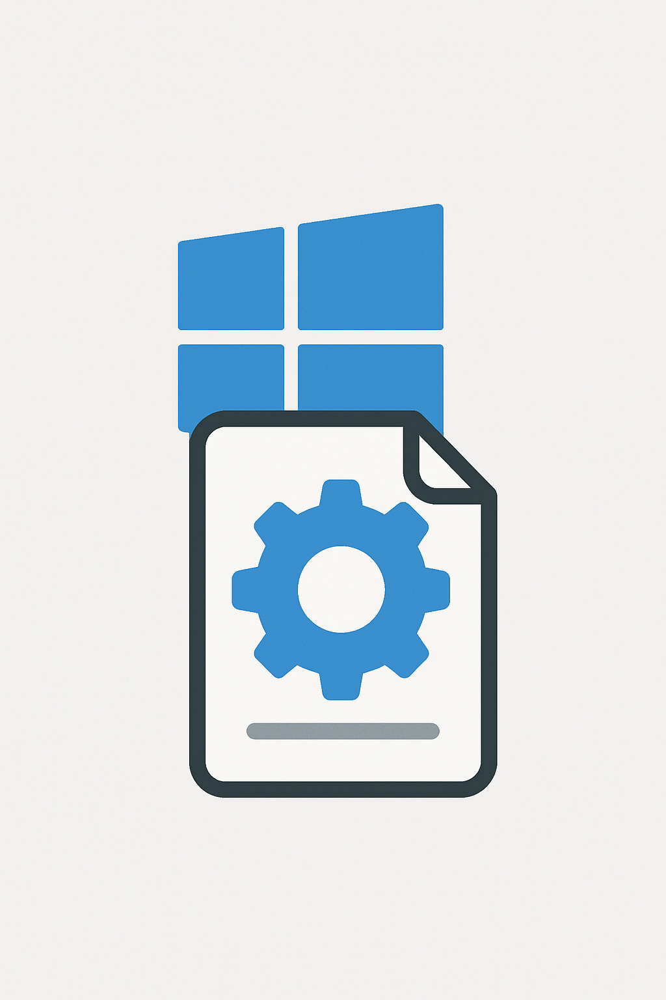

<div align="center">



# WinLet

**Modern Windows Service Manager**

*Wrap any application as a Windows Service using simple TOML configuration.*

</div>

## Installation and Usage

### 1. Build WinLet
```powershell
git clone https://github.com/your-repo/WinLet.git
cd WinLet
.\build.ps1

# Clean...
.\clean.ps1
```

### 2. Create Configuration
Create `my-app.toml`:
```toml
[service]
name = "my-web-app"
display_name = "My Web Application"

[process]
executable = "node"
arguments = "app.js"
working_directory = "C:\\Apps\\MyWebApp"

[logging]
log_path = "C:\\Logs\\MyWebApp"

[restart]
policy = "OnFailure"
max_attempts = 3
```

### 3. Install & Start Service
```powershell
# Install (requires admin - will prompt for UAC)
.\bin\WinLet.exe install --config my-app.toml

# Start service
.\bin\WinLet.exe start --name my-web-app
```

### 4. Manage Service
```powershell
# Check status
.\bin\WinLet.exe status --name my-web-app

# View logs
.\bin\WinLet.exe logs --name my-web-app

# Stop service
.\bin\WinLet.exe stop --name my-web-app
```

## Logging

WinLet creates logs in your configured `log_path`:
- `my-web-app.out.log` - Application stdout
- `my-web-app.err.log` - Application stderr  
- `winlet.log` - Service management events

## Examples

**Node.js Server:**
```toml
[service]
name = "my-api"
[process]
executable = "node"
arguments = "server.js"
working_directory = "C:\\Apps\\MyAPI"
[process.environment]
NODE_ENV = "production"
```

**Python Script:**
```toml
[service]
name = "data-processor"
[process]
executable = "python"
arguments = "processor.py"
working_directory = "C:\\Scripts"
```

## Features

✅ Any executable as Windows Service  
✅ Auto-restart policies  
✅ Rich logging with file rotation  
✅ Environment variables  
✅ UAC elevation handling  
✅ TOML configuration  

## Development Requirements 

- Windows 10/Server 2016+
- .NET 8.0 SDK (for building)
- Administrator privileges (for service operations)

## Runtime Requirements

- Windows 10/Server 2016+ (64-bit)
- Administrator privileges (for service operations)

## Roadmap

🚧 **Planned Features:**

### Monitoring & Observability
- [ ] Prometheus scrapable metrics (CPU, memory, restarts, uptime)
- [ ] Structured logging with JSON output
- [ ] Health check endpoints
- [ ] Performance counters integration

### Extensibility & Automation  
- [ ] Plugin system for custom rules and hooks
- [ ] Auto-discovery of common application types
- [ ] Template-based configuration generation
- [ ] Hot-reload configuration changes
- Other QoL features & improvements
- Verbosity levels

### Enhanced Service Management
- [ ] Bulk service operations (start/stop multiple services)
- [ ] Service dependency management
- [ ] Rolling updates and blue-green deployments
- [ ] Backup and restore service configurations
- [ ] Extend Log lifecycle management

### Maintenance
- [ ] Automatic log rotation and cleanup
- [ ] Resource usage optimization
- [ ] Memory leak detection and recovery
- [ ] Dead service cleanup utilities

### AI-Powered Features
- TBD

### Developer Experience
- [ ] Web dashboard for service management
- [ ] PowerShell module with cmdlets
- [ ] VS Code extension for config editing
- [ ] CI/CD pipeline templates

## License

MIT License